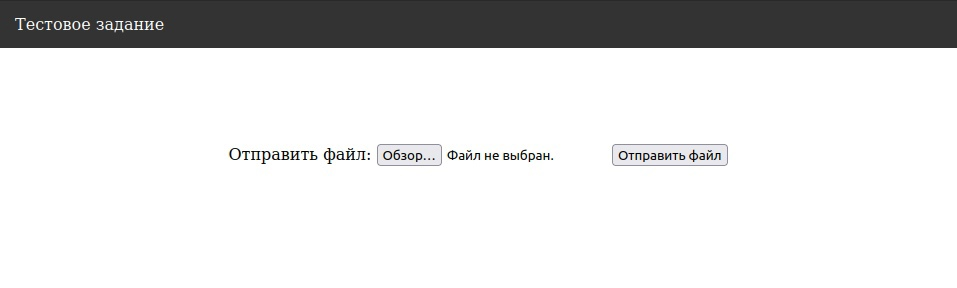
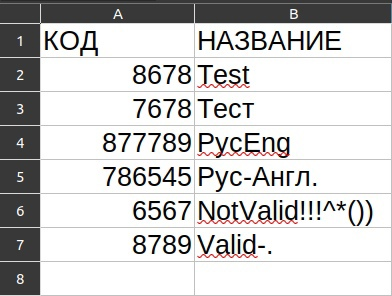
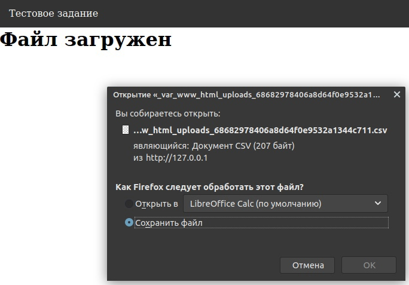
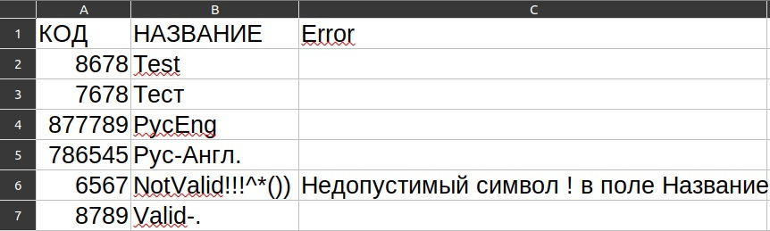

# This is the task for Junior PHP developer in Columbus East

## To run the application write in shell
```shell
docker-compose up -d --build
```
## After application get started 
* go to [localhost](http://127.0.0.1:80)
* go to [phpMyAdmin](http://127.0.0.1:3306)

* On localhost you will find something like this


* Then enter values to .CSV file with UTF-8 encoding


* After uploading file, the report file will automatically download


* After downloading open report file
